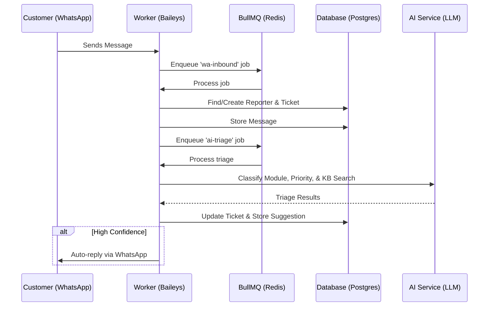
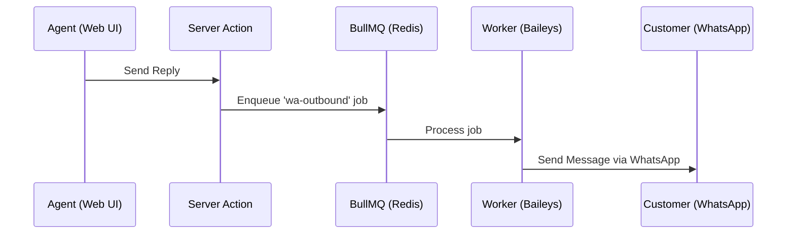
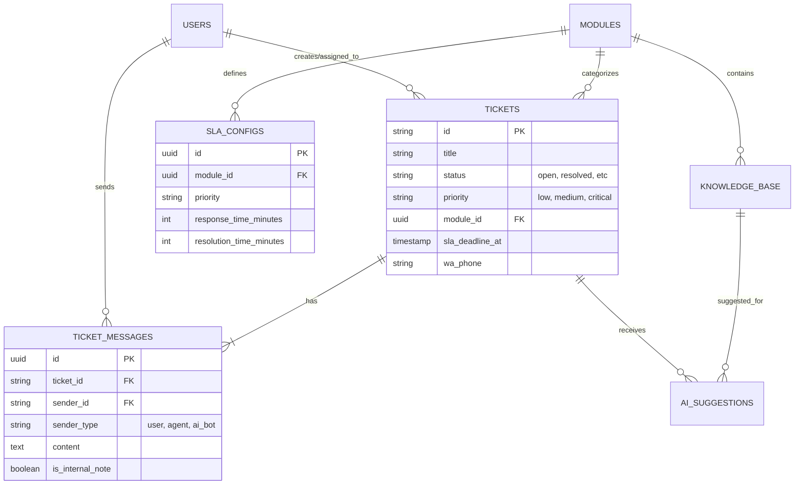

# 🕊️ SalamDesk

**SalamDesk** is an AI-powered, multichannel helpdesk system specifically engineered for healthcare environments (e.g., RSUD Karawang). It streamlines hospital operations by integrating WhatsApp messaging with automated AI triage, SLA management, and a robust Knowledge Base.

---

## 🛠️ Technical Stack

- **Framework:** [Next.js 16](https://nextjs.org/) (App Router), [React 19](https://react.dev/)
- **Runtime:** [Bun](https://bun.sh/)
- **Database:** PostgreSQL with [Drizzle ORM](https://orm.drizzle.team/)
- **Authentication:** [Better-Auth](https://www.better-auth.com/)
- **Background Jobs:** [BullMQ](https://docs.bullmq.io/) + [Redis](https://redis.io/)
- **AI Integration:** [Vercel AI SDK](https://sdk.vercel.ai/) via [OpenRouter](https://openrouter.ai/)
- **WhatsApp Integration:** [@whiskeysockets/baileys](https://github.com/WhiskeySockets/Baileys) (WebSocket)
- **UI Components:** Shadcn UI, Radix UI, Tailwind CSS
- **Query State:** [nuqs](https://nuqs.47ng.com/)

---

## 🏗️ Architecture & Data Flow

SalamDesk operates using a decoupled architecture. The **Next.js Web App** serves as the agent/admin interface, while a standalone **Worker Process** handles real-time WhatsApp connections and background processing.

### 📥 Inbound Message & Triage Flow


### 📤 Agent Outbound Flow


---

## 📊 Database Schema (ERD)



---

## ✨ Key Features

- **Multichannel Ticketing:** Primarily focused on WhatsApp integration via real-time WebSockets.
- **AI Triage:** Automatic classification of hospital modules (SIMRS), priority assessment, and KB article matching.
- **SLA Management:** Dynamic SLA deadlines based on module-specific configurations and ticket priority.
- **Knowledge Base:** Centralized documentation for agents with AI-suggested resolutions.
- **Quick Replies:** Template-based responses for common issues.
- **Internal Collaboration:** Internal notes and ticket escalation between agents.

---

## 🚀 Getting Started

### 1. Requirements
- Bun installed
- Redis instance running
- PostgreSQL (Supabase) instance

### 2. Installation
```bash
bun install
```

### 3. Environment Setup
Create a `.env` file based on `.env.example`:
```env
DATABASE_URL=...
REDIS_URL=...
OPENROUTER_API_KEY=...
```

### 4. Running the Application
You need to run **two separate processes**:

**Web Application (Next.js):**
```bash
bun dev
```

**Background Worker & WhatsApp Socket:**
```bash
bun worker
```

---

## 📁 Project Structure

- `src/app`: Next.js pages and routes.
- `src/actions`: Server Actions for business logic.
- `src/services`: Shared business logic and external integrations.
- `src/worker`: BullMQ worker implementations and WhatsApp bot logic.
- `src/db/schema`: Drizzle ORM table definitions.
- `src/lib`: Utility functions and shared clients (Redis, DB, etc).
